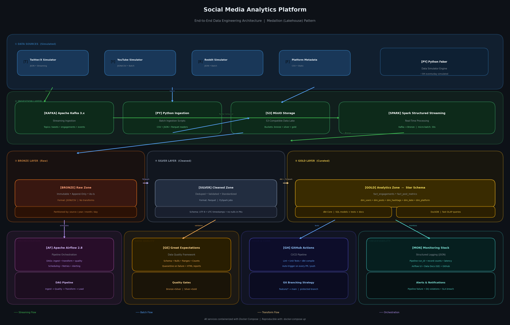

# Social Media Analytics Platform
### End-to-End Data Engineering Pipeline · Medallion Architecture · Batch + Streaming

[](https://github.com/YOUR_USERNAME/social-media-analytics-platform/actions/workflows/ci.yml)
[](https://github.com/YOUR_USERNAME/social-media-analytics-platform/actions/workflows/dbt_validate.yml)
[](https://github.com/YOUR_USERNAME/social-media-analytics-platform/actions/workflows/docker_validate.yml)
[](https://www.python.org/)
[](https://spark.apache.org/)
[](https://kafka.apache.org/)
[](https://www.getdbt.com/)
[](https://airflow.apache.org/)
[](LICENSE)

---

## Overview

A production-grade **Social Media Analytics Data Platform** built from scratch to demonstrate real-world Data Engineering skills. The platform simulates, ingests, transforms, and serves analytics-ready data from multiple social media sources — processing **~5 million events per day** through a complete **Medallion Architecture (Bronze → Silver → Gold)** pipeline.

> **Portfolio Project** — Designed to mirror the architecture and practices used in enterprise Data Engineering teams working with tools like Databricks, Snowflake, and Microsoft Fabric.

---

## Architecture



### Data Flow

```
Data Sources (Simulated)
  ├── Twitter/X Simulator ──► Kafka Topic ──► Spark Streaming ──► Bronze
  ├── YouTube Simulator   ──► Landing Zone ──────────────────────► Bronze
  └── Reddit Simulator    ──► Landing Zone ──────────────────────► Bronze
                                                                      │
                                                              PySpark Job
                                                                      │
                                                                   Silver
                                                                      │
                                                               dbt Models
                                                                      │
                                                                    Gold ──► DuckDB Analytics
```

### Medallion Layers

| Layer | Purpose | Format | Latency |
|-------|---------|--------|---------|
| 🥉 **Bronze** | Raw, immutable, as-ingested data | JSON / CSV | < 5 min |
| 🥈 **Silver** | Deduplicated, validated, standardized | Parquet (partitioned) | < 15 min |
| 🥇 **Gold** | Business-ready Star Schema | Parquet + DuckDB | < 30 min |

---

## Tech Stack

| Component | Technology | Version |
|-----------|------------|---------|
| Streaming Ingestion | Apache Kafka | 3.x |
| Batch Processing | PySpark | 3.5.x |
| SQL Transformations | dbt Core | 1.7.x |
| Orchestration | Apache Airflow | 2.8.x |
| Object Storage | MinIO (S3-compatible) | Latest |
| Analytical DB | DuckDB | Latest |
| Data Quality | Great Expectations | 0.18.x |
| Containerization | Docker + Compose | Latest |
| CI/CD | GitHub Actions | — |
| Language | Python | 3.11 |

---

## Project Structure

```
social-media-analytics-platform/
├── .github/
│   ├── workflows/
│   │   ├── ci.yml                    # Lint + unit tests on every push
│   │   ├── dbt_validate.yml          # dbt compile + schema tests
│   │   └── docker_validate.yml       # Docker build + smoke test
│   └── ISSUE_TEMPLATE/
├── docker/
│   ├── docker-compose.yml            # Full local infrastructure
│   ├── airflow/Dockerfile
│   └── spark/Dockerfile
├── src/
│   ├── simulators/                   # Python Faker data generators
│   │   ├── twitter_simulator.py
│   │   ├── youtube_simulator.py
│   │   └── reddit_simulator.py
│   ├── ingestion/                    # Batch + streaming ingestion
│   │   ├── kafka_producer.py
│   │   ├── batch_ingestion.py
│   │   └── schemas/
│   ├── transformation/
│   │   ├── spark_jobs/               # PySpark Bronze → Silver jobs
│   │   │   ├── bronze_to_silver.py
│   │   │   └── utils/
│   │   └── dbt/                      # dbt project (Silver → Gold)
│   │       ├── models/
│   │       │   ├── staging/          # stg_twitter__tweets.sql, ...
│   │       │   ├── intermediate/     # int_posts_enriched.sql, ...
│   │       │   └── marts/
│   │       │       ├── facts/        # fact_engagements.sql, ...
│   │       │       └── dimensions/   # dim_users.sql, dim_date.sql, ...
│   │       ├── tests/
│   │       └── dbt_project.yml
│   └── orchestration/
│       └── dags/                     # Airflow DAG definitions
│           ├── ingestion_pipeline.py
│           ├── transformation_pipeline.py
│           └── daily_refresh.py
├── quality/
│   └── expectations/                 # Great Expectations checkpoints
├── tests/
│   ├── unit/                         # pytest unit tests
│   └── integration/                  # Integration tests
├── docs/
│   ├── architecture_diagram.png
│   ├── PRD_SocialMedia_Analytics.docx
│   ├── TAD_SocialMedia_Analytics.docx
│   └── data_dictionary.md
├── Makefile                          # Developer convenience commands
├── .gitignore
├── .pre-commit-config.yaml
├── requirements.txt
├── requirements-dev.txt
└── README.md
```

---

## Quick Start

### Prerequisites

- [Docker Desktop](https://www.docker.com/products/docker-desktop/) (v24+)
- [Git](https://git-scm.com/)
- 8GB RAM minimum (16GB recommended)

### Setup in 3 Commands

```bash
# 1. Clone the repository
git clone https://github.com/YOUR_USERNAME/social-media-analytics-platform.git
cd social-media-analytics-platform

# 2. Start all infrastructure services
make up

# 3. Run the full pipeline end-to-end
make pipeline-run
```

### Access the Services

| Service | URL | Credentials |
|---------|-----|-------------|
| Airflow UI | http://localhost:8090 | admin / admin |
| MinIO Console | http://localhost:9001 | minioadmin / minioadmin |
| Spark Master UI | http://localhost:8080 | — |

---

## Development Guide

### Available Make Commands

```bash
make help           # Show all available commands
make up             # Start all Docker services
make down           # Stop all Docker services
make logs           # Tail all service logs
make shell          # Open Python shell in Spark container

# Pipeline
make simulate       # Run data simulators (generates ~100K events)
make ingest         # Run batch ingestion jobs
make transform      # Run PySpark Bronze → Silver
make dbt-run        # Run dbt Silver → Gold
make quality        # Run all Great Expectations checkpoints
make pipeline-run   # Run complete pipeline end-to-end

# Development
make lint           # Run flake8 linter
make test           # Run pytest unit tests
make test-cov       # Run tests with coverage report
make dbt-docs       # Generate and serve dbt documentation
make format         # Auto-format code with black + isort
make pre-commit     # Run pre-commit hooks on all files

# Data
make seed           # Load static dimension seed data
make backfill DAYS=7  # Backfill pipeline for last N days
make reset          # Drop all data and restart from scratch (⚠️ destructive)
```

### Branching Strategy

```
main              ← protected, requires PR + CI pass
└── develop       ← integration branch
    ├── feature/bronze-ingestion-kafka
    ├── feature/silver-pyspark-transform
    ├── feature/dbt-star-schema
    └── fix/dedup-window-function
```

### Commit Convention

```
feat(ingestion): add Kafka producer for tweet simulator
fix(spark): resolve duplicate records in bronze-to-silver job
test(dbt): add schema tests for fact_engagements null checks
docs(readme): update quick start with new make commands
chore(ci): add docker compose smoke test to PR workflow
```

---

## Data Model

### Star Schema (Gold Layer)

```
                    ┌─────────────┐
                    │  dim_date   │
                    └──────┬──────┘
                           │
┌──────────────┐    ┌──────┴──────────────┐    ┌──────────────┐
│  dim_users   ├────┤  fact_engagements   ├────┤  dim_posts   │
└──────────────┘    └──────┬──────────────┘    └──────────────┘
                           │
              ┌────────────┴──────────────┐
              │                           │
    ┌─────────┴──────┐         ┌─────────┴──────────┐
    │  dim_platforms │         │    dim_hashtags     │
    └────────────────┘         └────────────────────┘
```

### Key Business Metrics (Gold Layer)

| Metric | Definition | dbt Model |
|--------|-----------|-----------|
| Engagement Rate | (likes + shares + comments) / impressions × 100 | `fact_post_metrics` |
| Daily Active Users | Unique users with ≥1 engagement per day | `mart_daily_active_users` |
| Top Hashtags | Hashtags by total engagement in rolling 7-day window | `mart_trending_hashtags` |
| Brand Share of Voice | Brand mentions / total platform mentions × 100 | `mart_share_of_voice` |

---

## Pipeline Design Principles

- **Idempotency** — Every pipeline job is safe to re-run without creating duplicates
- **Schema-on-Write** — Strict schema enforcement at Silver layer ingestion
- **Quality Gates** — Great Expectations blocks pipeline promotion on data quality failure
- **Observability** — All jobs emit structured JSON logs with `run_id`, `records_processed`, `duration_seconds`
- **Portability** — MinIO (local) is 100% API-compatible with AWS S3 — zero code changes to deploy to cloud
- **Reproducibility** — Full environment starts with `docker-compose up` — no manual dependencies

---

## CI/CD Pipeline

Every push triggers automated checks:

```
Push / PR
    │
    ├── ci.yml
    │   ├── flake8 lint
    │   ├── pytest unit tests
    │   └── coverage report (min 80%)
    │
    ├── dbt_validate.yml
    │   ├── dbt deps
    │   ├── dbt compile
    │   └── dbt test (schema + data tests)
    │
    └── docker_validate.yml (PRs to main only)
        ├── docker compose build
        ├── docker compose up --wait
        └── smoke test (health checks)
```

---

## Documentation

| Document | Description |
|----------|-------------|
| [PRD](docs/PRD_SocialMedia_Analytics.docx) | Problem definition, requirements, project scope |
| [TAD](docs/TAD_SocialMedia_Analytics.docx) | Technical architecture, ADRs, data model, infrastructure |
| [Data Dictionary](docs/data_dictionary.md) | Column-level documentation for all tables |
| [dbt Docs](http://localhost:8080) | Auto-generated dbt lineage and model documentation (run `make dbt-docs`) |

---

## Implementation Status

| Step | Component | Status | Tests |
|------|-----------|--------|-------|
| 1 | Problem Definition (PRD) | ✅ Complete | — |
| 2 | Architecture Design (TAD + Star Schema) | ✅ Complete | — |
| 3 | Repository Setup + CI/CD skeleton | ✅ Complete | — |
| 4 | Docker Infrastructure (7 services) | ✅ Complete | — |
| 5 | Data Simulators (Twitter, YouTube, Reddit) | ✅ Complete | 25 tests |
| 6 | Ingestion Layer (Kafka consumer + Batch) | ✅ Complete | 25 tests |
| 7 | Transformation (PySpark Bronze→Silver + dbt) | ✅ Complete | 30 tests |
| 8 | Orchestration (3 Airflow DAGs) | ✅ Complete | 41 tests |
| 9 | Data Quality (7 GE expectation suites) | ✅ Complete | 44 tests |
| 10 | Integration + Final Packaging | ✅ Complete | 52 tests |

**Total: 217 tests across all layers · 87 project files · 51 source modules**

## Roadmap

- [x] Phase 1: Problem Definition (PRD)
- [x] Phase 2: Architecture Design (TAD + Diagram)
- [x] Phase 3: Repository Setup
- [x] Phase 4: Infrastructure (Docker Compose)
- [x] Phase 5: Data Simulators
- [x] Phase 6: Ingestion Layer (Kafka + Batch)
- [x] Phase 7: Transformation Layer (PySpark + dbt)
- [x] Phase 8: Orchestration (Airflow DAGs)
- [x] Phase 9: Data Quality (Great Expectations)
- [ ] Phase 10: CI/CD (GitHub Actions — full pipeline)
- [ ] Phase 11: Observability (dashboards)
- [ ] Phase 12: Portfolio Polish

---

## License

This project is licensed under the MIT License — see the [LICENSE](LICENSE) file for details.

---

<p align="center">Built with focus on real-world Data Engineering practices</p>
